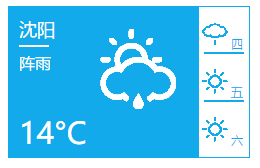

# Weather-js

网页天气插件,可根据IP自动获取城市

天气数据获取：[和风天气](http://www.heweather.com/)

IP地址获取：[ipinfo](http://ipinfo.io/)

使用说明

复制以下代码到html文件中即可直接使用默认效果，默认效果如图,或访问[Git Pages](http://hyperiond.github.io/weather-js/)

```html
<link rel="stylesheet" type="text/css" href="./defaults/style.css" />

<div class="weather"></div>

<script src="weather-es5.js"></script>
<script>
  var options = {
    apiUrlBase: '',
    header: '',
    IPUrl: '',
    imgDir: '',
    IP: true,
    city: '',
    successFunc: '',
    errorFunc: '',
  }
  weather(options);
</script>
```



参数说明

参数值为空字符串则会自动获取默认值，默认值在weather.js中defaults定义

| 参数 | 说明     |
| :------------- | :------------- |
| apiUrlBase      | 获取天气的API地址|
| header | 天气API需要用到的header |
| IPUrl | 获取ip的API地址 |
| imgDir | 天气图片存放路径 |
| IP | true为自动根据IP判断城市，false为读取city字段定义的城市，不根据IP判断 |
| city | 城市名，汉语拼音，IP字段为true则该项无用 |
| successFunc | 函数, function(data) {}, 处理获取的天气数据 |
| errorFunc | 函数, function() {}, 获取天气数据错误后执行 |
